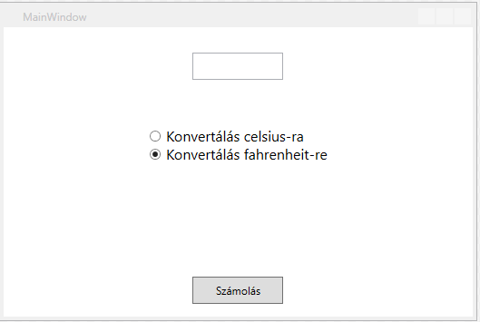

# WPF alkalmazás tesztelésének automatizálása

Egy komplexebb alkalmazás az egyes osztályokon kívül számos grafikus felületet (UI-user interface) foglalhat magába. Nem csak a háttérben dolgozó egységek tesztelése szükséges, hanem a UI működését is szükséges tesztelni. Ennek az elvégzése fáradtságos munkával járhat, ezért szükség lehet a tesztelés automatizálására.

A windowsos grafikus felületű alkalmazások automatizált tesztelése hasonlít a böngészőben végzett tesztekhez. A felület elemeibe adatokat küldhetünk, gombra kattintást programozhatunk stb. Az egyes tesztesetekre tesztekek készíthetünk, és utána annyiszor futtathatóak, amennyiszer szükséges. A tesztek eredményéről riportot lehet készíteni stb.

A cél: Egy nagyon egyszerű, Celsius-Fahrenheit hőmérséklet átszámító program készítése, majd tesztelése automatizált teszttel, és a végén riport készítése a tesztek futásáról.

Egy új Wpf alkalmazás a kiindulópont a projekt neve legyen **WpfHomersekletAtvalto**.

A projekt létrehozása után adjunk hozzá egy új osztályt az osztály neve legyen **HomersekletAtvalto**. Erre az osztályra bízzuk a megfelelő hőmérsékletértékek kiszámítását. Két metódusa lesz, az egyik Celsius fokot vált Fahrenheit-re, a másik Fahrenheit fokot Celsiusra. Statikus osztály lesz, így nem lesz szükség külön példányosításra.

Az osztály kódja,metódusai:
```C#
using System;
using System.Collections.Generic;
using System.Linq;
using System.Text;
using System.Threading.Tasks;

namespace WpfHomersekletAtvalto
{
    public static class HomersekletAtvalto
    {
       

        public static double CelsiusToFahrenheit(double celsius)
        {

            return (celsius * 1.8) + 32;
        }

        public static double FahrenheitToCelsius(double fahrenheit)
        {

            return (fahrenheit - 32) / 1.8;
          
        }
    }
}
```

### Az alkalmazás felülete így fog kinézni:



### A felületet leíró XAML kód (egy Gird-et használunk):
```XML
<Grid>
        <Grid.RowDefinitions>
            <RowDefinition Height="3*"/>
            <RowDefinition Height="3*"/>
            <RowDefinition Height="3*"/>
            <RowDefinition Height="2*"/>
        </Grid.RowDefinitions>
        <TextBox x:Name="homersekletErtek" AutomationProperties.AutomationId="homersekletErtek" MaxHeight="30" MaxWidth="100" FontSize="20" />
        <StackPanel Grid.Row="1" HorizontalAlignment="Center" VerticalAlignment="Center">
            <RadioButton x:Name="celsiusKivalaszt" AutomationProperties.AutomationId="celsiusKivalaszt"  Content="Konvertálás celsius-ra" FontSize="16" VerticalContentAlignment="Center" />
            <RadioButton x:Name="fahrenheitKivalaszt" AutomationProperties.AutomationId="fahrenheitKivalaszt"  Content="Konvertálás fahrenheit-re" FontSize="16" VerticalContentAlignment="Center" IsChecked="True" />
        </StackPanel>
        <TextBlock x:Name="konvertaltHomerseklet" AutomationProperties.AutomationId="konvertaltHomerseklet" FontSize="30" HorizontalAlignment="Center" VerticalAlignment="Center" Grid.Row="2" />
        <Button x:Name="buttonKonvertalas" AutomationProperties.AutomationId="buttonKonvertalas" Content="Számolás" Grid.Row="3" MaxWidth="100" MaxHeight="30" Click="buttonKonvertalas_Click" />
    </Grid>
```
Az egyes elemeknél feltűnhet az **AutomationProperties.AutomationId**. Ezt az azonosítót használjuk a tesztben majd az elem kiválasztására, elérésére.

A **Számolás** feliratú gomb lenyomására végezzük el a kívánt műveleteket a mögöttes kódban (**MainWindow.xaml.cs**) :

```C#
private void buttonKonvertalas_Click(object sender, RoutedEventArgs e)
        {
            try
            {
                if (fahrenheitKivalaszt.IsChecked==true)
                {
                    konvertaltHomerseklet.Text = Convert.ToString(HomersekletAtvalto.CelsiusToFahrenheit(Convert.ToDouble(homersekletErtek.Text)));
                } else
                {
                    konvertaltHomerseklet.Text = Convert.ToString(HomersekletAtvalto.FahrenheitToCelsius(Convert.ToDouble(homersekletErtek.Text)));
                }
                

            }
            catch (Exception ex)
            {
                MessageBox.Show(ex.Message,"Hiba!");
                
            }
            
        }
```
## A tesztelési környezet kiépítése

Az előbb egy meglehetősen egyszerű programot készítettünk a valóságban ez egy jóval összetettebb program lenne... Gondoljuk azt, hogy egy bonyolult programot tesztelünk.

## Appium
Az Appium  nyílt forrású tesztelési környezet, IOS, Windows, Android alkalmazások teszteléséhez.
[Az Appium weboldala](https://appium.io/)

Az automatizáláshoz szükség lesz egy Windows Application Driver nevű alkalmazás telepítésére.
[Windows Application Driver letöltése](https://github.com/microsoft/WinAppDriver/releases/download/v1.1/WindowsApplicationDriver.msi)

